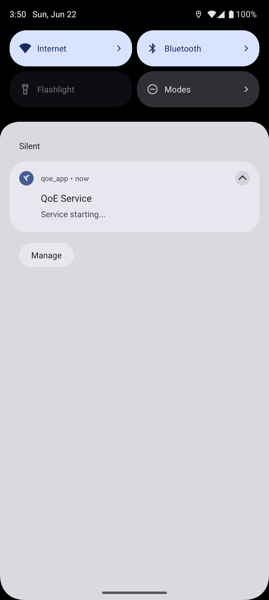

# Feedback

Feedback App is a Flutter application designed to measure and analyze the Quality of Experience (QoE) for mobile network users. The app collects device, network, SIM, and location data to provide insights into connectivity quality and user experience. It is intended for research, diagnostics, and user feedback in real-world mobile environments.

## Features

- Collects real-time network signal strength and SIM information
- Gathers device and OS details
- Tracks and displays user location (with permission)
- Measures internet speed and connectivity quality
- Provides user feedback and reporting interface
- Supports notifications and background services
- Designed for both Android and iOS (with Android-specific features where applicable)

## Screenshots

<!-- Replace the paths below with your actual screenshot image paths -->
| Home Screen | Network Info | Speed Test | Feedback |
|-------------|--------------|------------|----------|
|  |  |  |  |

## Getting Started

1. Clone the repository:
   ```sh
   git clone https://github.com/yourusername/qoe_app.git
   cd qoe_app
   ```
2. Install dependencies:
   ```sh
   flutter pub get
   ```
3. Set up your environment variables:
   - Copy `.env.example` to `.env` and fill in the required values:
     ```env
     LOCATION_IQ_KEY=YOUR_LOCATIONIQ_KEY
     SUPABASE_URL=YOUR_SUPABASE_URL
     SUPABASE_ANON_KEY=YOUR_SUPABASE_ANON_KEY
     ```
4. Run the app:
   ```sh
   flutter run
   ```

## Permissions

The app requests the following permissions:
- **Location**: To gather location-based QoE data
- **Phone and SIM info**: For network diagnostics (Android only)
- **Notifications**: For alerts and background tasks
- **Battery Optimization (Android only)**: Prompts users to disable battery optimization for accurate background data collection

Permissions are requested at runtime and are required for full functionality.

## Supabase Setup

This project uses [Supabase](https://supabase.com/) as its backend for authentication and data storage.

### Steps to Set Up Supabase:

1. **Create a Supabase Project**
   - Go to [Supabase Dashboard](https://app.supabase.com/) and create a new project.
   - Note your Project URL and Anon Key (used in your `.env` file).

2. **Create the Required Tables**

   In the Supabase SQL editor, create the following tables based on the app models:

   **Device Table**
   ```sql
   create table Device (
     id serial primary key,
     created_at timestamp with time zone default timezone('utc'::text, now()),
     ipaddress text,
     location_name text,
     long double precision,
     lat double precision,
     device_name text,
     number_of_sims integer,
     token text,
     updated_at timestamp with time zone default timezone('utc'::text, now()),
     device_identifier text unique
   );
   ```

   **NetworkStatistics Table**
   ```sql
   create table NetworkStatistics (
     id serial primary key,
     created_at timestamp with time zone default timezone('utc'::text, now()),
     device_id integer references Device(id),
     carrier_name text,
     jitter double precision,
     latency double precision,
     signal_strength text,
     packet_loss double precision,
     bandwidth double precision,
     location_name text,
     long double precision,
     lat double precision,
     network_type text,
     ip text
   );
   ```

   **Reviews Table**
   ```sql
   create table Reviews (
     id serial primary key,
     created_at timestamp with time zone default timezone('utc'::text, now()),
     device_id integer references Device(id),
     rating double precision not null,
     comment text not null
   );
   ```

   **Event Table** (for real-time events, if used)
   ```sql
   create table Event (
     id serial primary key,
     created_at timestamp with time zone default timezone('utc'::text, now()),
     -- Add your event fields here
   );
   ```

3. **Enable Row Level Security (RLS)**
   - Enable RLS on each table and add appropriate policies for your app’s needs.

4. **Configure API Keys**
   - Use the Project URL and Anon Key in your `.env` file for the app to connect to Supabase.

## Contributing

Contributions are welcome! Please open issues or submit pull requests for improvements and bug fixes.

## License

This project is licensed under the MIT License.

---

For more information, see the project documentation or contact the maintainer.
